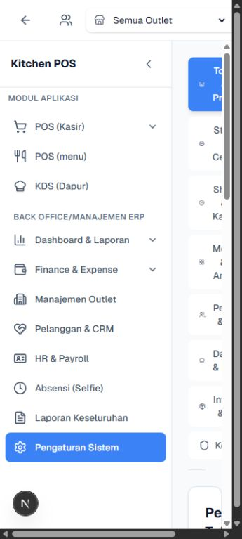
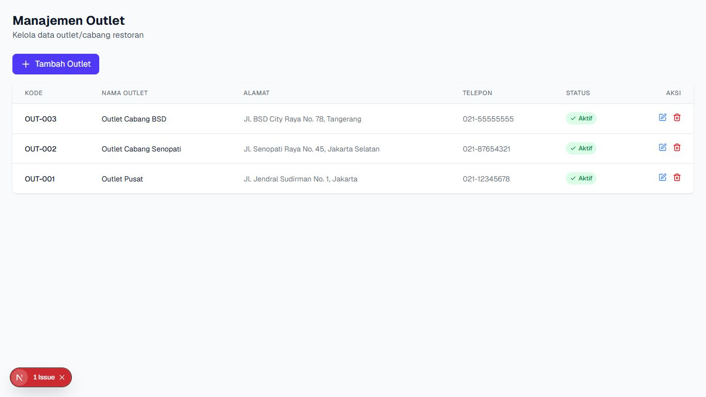
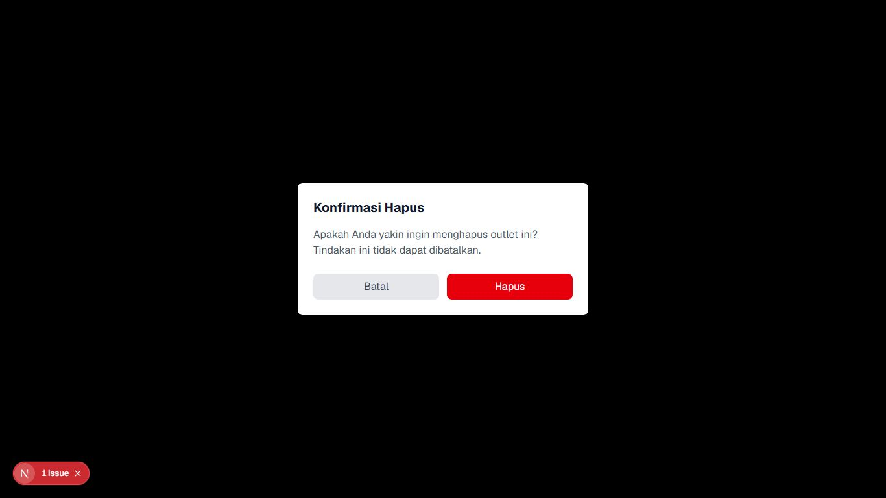
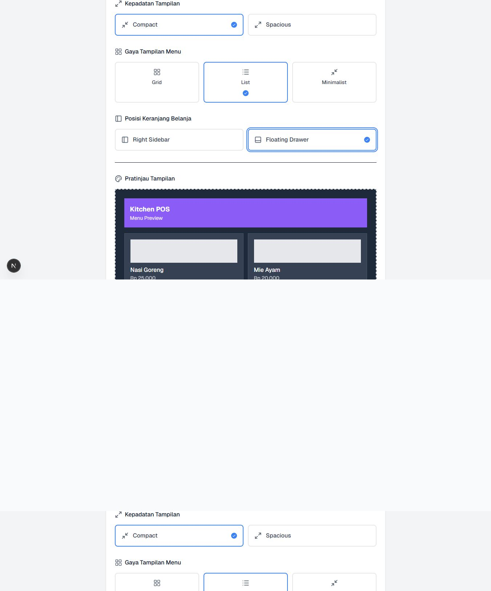
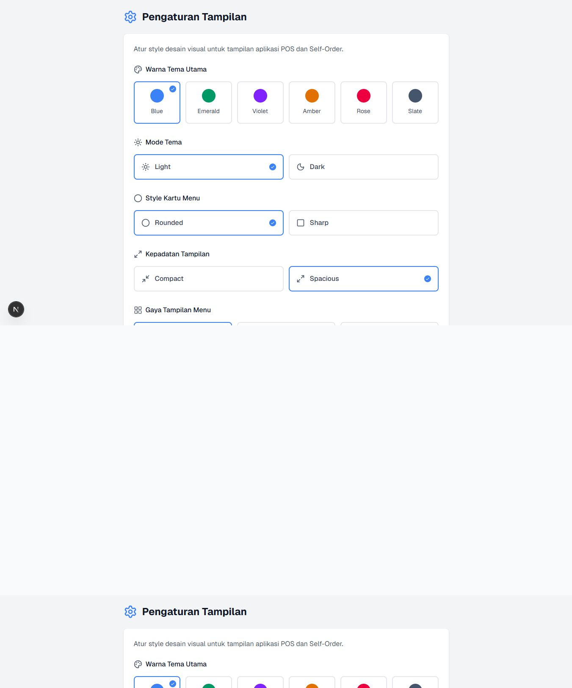
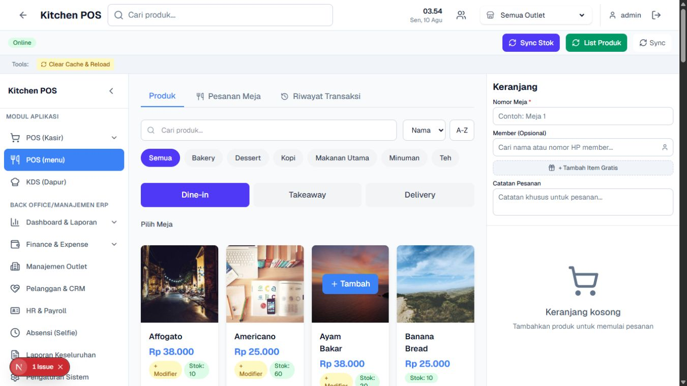

# Task 6 — Organization, settings, and theme audit

## Audit scope

Combined UX and accessibility audit of `/admin/outlets`, `/pos/settings`, and all eight sections of `/admin/settings`, captured with the Codex in-app Browser on 2026-08-10. The three route baselines were captured at all six required viewports: `360x800`, `768x1024`, `1024x768`, `1366x768`, `1440x900`, and `1920x1080`. Deeper outlet, theme, POS propagation/back, outlet-switch, and settings-section states were exercised at `360x800`, `768x1024`, and `1366x768` where safely reachable.

Target experience used for comparison: searchable Odoo/OCA-style `/apps` launcher with separate Point of Sale, Kitchen Display, Menu & Products, Attendance, and HR & Payroll apps; module-scoped child menus; deterministic POS Back to `/apps`; app-owned AlertDialog/inline validation; and explicit `organization default -> outlet override -> user/device preference` ownership.

## Overall verdict

The desktop settings surfaces are visually coherent and the eight administration sections are reasonably organized, but the configuration experience is not operationally reliable. Both tested write paths failed: outlet creation silently closed with no error and theme saving reported failure. Static implementation evidence also shows that the intended settings precedence is **not implemented**: the app has one global `AppSettings` record, while the outlet selector persists only a local `selectedOutletId` and is not a settings-ownership layer. Mobile organization/settings work is severely constrained even after collapsing the sidebar, and POS Back follows browser history rather than returning to `/apps`.

No P0 was confirmed. Four P1 issues block reliable configuration or mobile use.

## Route and viewport matrix

| Route | 360x800 | 768x1024 | 1024x768 | 1366x768 | 1440x900 | 1920x1080 | Deep coverage |
|---|---|---|---|---|---|---|---|
| `/admin/outlets` | `01` poor; actions hidden | `04` fair; final action clipped | `07` good | `10` good | `13` good | `16` good | create, native validation, two failed saves, edit cancel, delete confirm cancel |
| `/pos/settings` | `02` fair; long scroll | `05` good | `08` good | `11` good | `14` good | `17` good | accent, light/dark, rounded/sharp, density, grid/list, cart position, preview, failed save, reload restore, POS propagation |
| `/admin/settings` | `03` unusable expanded shell | `06` fair | `09` good | `12` good | `15` good | `18` good | all 8 tabs at 360 collapsed (`48-55`), 768 (`40-47`), and 1366 (`32-39`) |

All 18 baseline cells have an accepted current-run screenshot. Total accepted evidence: **55 screenshots**.

## Numbered evidence

1. `01-admin-outlets-360x800.png` — mobile outlet list; only code and name remain, with no visible status/edit/delete.
2. `02-pos-settings-360x800.png` — mobile theme controls; usable but long, with no surrounding app navigation or Back control.
3. `03-admin-settings-360x800.png` — expanded sidebar consumes most of the screen and forces page-level horizontal scroll.
4. `04-admin-outlets-768x1024.png` — tablet outlet table; delete/action edge is clipped.
5. `05-pos-settings-768x1024.png` — tablet theme controls.
6. `06-admin-settings-768x1024.png` — tablet Store & Profile baseline.
7. `07-admin-outlets-1024x768.png` — landscape tablet outlet list.
8. `08-pos-settings-1024x768.png` — landscape tablet theme controls.
9. `09-admin-settings-1024x768.png` — landscape tablet Store & Profile.
10. `10-admin-outlets-1366x768.png` — desktop outlet list.
11. `11-pos-settings-1366x768.png` — desktop theme controls.
12. `12-admin-settings-1366x768.png` — desktop Store & Profile.
13. `13-admin-outlets-1440x900.png` — wide desktop outlet list.
14. `14-pos-settings-1440x900.png` — wide desktop theme controls.
15. `15-admin-settings-1440x900.png` — wide desktop Store & Profile.
16. `16-admin-outlets-1920x1080.png` — full-HD outlet list.
17. `17-pos-settings-1920x1080.png` — full-HD theme controls.
18. `18-admin-settings-1920x1080.png` — full-HD Store & Profile.
19. `19-outlet-create-dialog-1366x768.png` — create form and labeled fields.
20. `20-outlet-empty-submit-validation-1366x768.png` — browser-native required-field bubble, not an app-owned inline error.
21. `21-outlet-create-filled-1366x768.png` — exact-prefix first fixture attempt before submit.
22. `22-outlet-create-save-result-1366x768.png` — form closed, no record row or UI error; dev issue badge appears.
23. `23-outlet-edit-seeded-cancel-only-1366x768.png` — seeded record edit form inspected and cancelled without changes.
24. `24-outlet-delete-confirm-seeded-cancel-only-1366x768.png` — in-app destructive confirmation inspected and cancelled.
25. `25-pos-settings-alternate-preview-dark-fullpage-1366x768.png` — Violet/Dark/Sharp/Compact/List/Floating Drawer client preview.
26. `26-pos-settings-alternate-save-failed-1366x768.png` — failed save state; UI reported `Gagal menyimpan pengaturan`.
27. `27-pos-settings-reload-restored-original-1366x768.png` — reload restored Blue/Light/Rounded/Spacious/Grid/Right Sidebar.
28. `28-pos-propagation-original-theme-1366x768.png` — `/pos` initially required authentication.
29. `29-pos-authenticated-original-theme-1366x768.png` — authenticated POS retained original light/blue/grid/right-sidebar presentation.
30. `30-pos-back-destination-1366x768.png` — POS Back returned to `/pos/settings`, proving history-dependent behavior rather than `/apps`.
31. `31-pos-outlet-pusat-selected-1366x768.png` — Outlet Pusat selected; selection survived reload before being restored.
32. `32-admin-settings-store-profile-1366x768.png` — Store & Profile desktop.
33. `33-admin-settings-receipt-print-1366x768.png` — Receipt & Print desktop.
34. `34-admin-settings-shift-cashier-1366x768.png` — Shift & Cashier desktop.
35. `35-admin-settings-tables-area-1366x768.png` — Tables & Area desktop.
36. `36-admin-settings-users-access-1366x768.png` — Users & Access desktop.
37. `37-admin-settings-kitchen-kds-1366x768.png` — Kitchen & KDS desktop.
38. `38-admin-settings-inventory-stock-1366x768.png` — Inventory & Stock desktop.
39. `39-admin-settings-security-1366x768.png` — Security desktop.
40. `40-admin-settings-store-profile-768x1024.png` — Store & Profile tablet.
41. `41-admin-settings-receipt-print-768x1024.png` — Receipt & Print tablet.
42. `42-admin-settings-shift-cashier-768x1024.png` — Shift & Cashier tablet.
43. `43-admin-settings-tables-area-768x1024.png` — Tables & Area tablet.
44. `44-admin-settings-users-access-768x1024.png` — Users table requires internal horizontal scrolling.
45. `45-admin-settings-kitchen-kds-768x1024.png` — Kitchen & KDS tablet.
46. `46-admin-settings-inventory-stock-768x1024.png` — Inventory & Stock tablet.
47. `47-admin-settings-security-768x1024.png` — Security tablet.
48. `48-admin-settings-store-profile-360x800-collapsed.png` — Store mobile after sidebar collapse; page still horizontally scrolls.
49. `49-admin-settings-receipt-print-360x800-collapsed.png` — Receipt mobile.
50. `50-admin-settings-shift-cashier-360x800-collapsed.png` — Shift mobile.
51. `51-admin-settings-tables-area-360x800-collapsed.png` — Tables mobile.
52. `52-admin-settings-users-access-360x800-collapsed.png` — Users mobile.
53. `53-admin-settings-kitchen-kds-360x800-collapsed.png` — Kitchen mobile.
54. `54-admin-settings-inventory-stock-360x800-collapsed.png` — Inventory mobile.
55. `55-admin-settings-security-360x800-collapsed.png` — Security mobile.

### Key visual evidence

## Strengths

- Desktop admin sections use consistent cards, headings, visible labels, spacing, and a stable Save/Reset action pair.
- All eight settings categories are present and use clear Indonesian labels.
- Theme controls provide immediate visual preview across accent, light/dark, card shape, density, layout, and cart position.
- The outlet destructive action uses an in-app confirmation with clear danger styling and irreversible-action copy; it is not a native `confirm()`.
- Store, Receipt, Shift, Kitchen, Inventory, and Security inputs expose useful labels in the accessibility snapshot.
- The settings tabs have strong visible focus treatment and clear visual active state.
- Outlet selection persists across reload, which is useful as a device/session preference; it was restored to `Semua Outlet` after the audit.

## Findings

### P1-1 — Core configuration writes fail, and outlet creation fails silently

**Evidence:** `21`, `22`, `25-27`; `web.stderr.log:1151-1170` records both outlet failures, including the second short-code attempt; `web.stderr.log:1171-1179` records the theme-save failure.  
**Reproduction:** fill the outlet form and submit; then choose Violet/Dark/Sharp/Compact/List/Floating Drawer and save.  
**Observed:** the first exact-code/name attempt is shown in `21-22`. The second attempt used code `UXR-CFG-001` with the exact-prefixed name/address; the second independent `Error creating outlet: Error: Failed to create outlet` entry is at `web.stderr.log:1161-1170`. Both attempts closed the modal, created no row, returned no fixture ID, and showed no app error. Theme preview updated client-side, but Save showed `Gagal menyimpan pengaturan`; console logged `Failed to save settings: Error: Failed to save settings`. Reload returned every theme option to its original value. Because neither attempt persisted a record, the fixture-prefix restriction was never violated by stored data.  
**Expected:** the modal should close only after confirmed persistence; failed writes need a nearby, app-owned error with recovery. Theme Save should persist and confirm the effective scope.  
**Impact:** admins cannot trust organization setup or appearance configuration. Silent outlet loss is especially dangerous because the form visually behaves like a successful submit.

### P1-2 — Organization/settings are not viable at 360 px

**Evidence:** `01`, `03`, `48-55`.  
**Reproduction:** open each scoped route at `360x800`; on `/admin/settings`, inspect the expanded shell, collapse the sidebar, then open each of the eight settings sections.  
**Observed:** the expanded settings sidebar consumes most of 360 px. Even after collapse, a fixed icon rail remains, page-level horizontal scrolling remains, the eight settings tabs form a tall vertical stack, and the actual form starts roughly halfway down the viewport. On `/admin/outlets`, address, phone, status, and both row actions disappear entirely; no card or overflow action replaces them.  
**Expected:** a mobile overlay drawer, one-column settings navigation, reflowed fields, and a mobile outlet list/card view with reachable actions.  
**Impact:** outlet and system configuration cannot be completed reliably on the supported mobile viewport.

### P1-3 — POS Back is history-dependent instead of deterministic `/apps`

**Evidence:** `29-30`.  
**Reproduction:** navigate from `/pos/settings` to `/pos`, authenticate, then press `Kembali`.  
**Observed:** URL returned to `/pos/settings`.  
**Expected:** POS Back should always land on `/apps`, independent of prior browser history.  
**Impact:** operators cannot predict where an operational exit goes, and the app hierarchy does not match the target module launcher.

### P1-4 — The intended organization/outlet/device settings precedence is not implemented

**Evidence:** browser evidence `12`, `27`, `31`, `32-39`; static implementation evidence `prisma/schema.prisma:376-429`, `server/routes/settings.ts:8-25`, `server/routes/settings.ts:35-53`, `server/routes/settings.ts:104-107`, `src/context/ThemeContext.tsx:30-48`, `src/context/ThemeContext.tsx:50-94`, and `src/features/outlet/outletStore.ts:21-57`.  
**Reproduction:** inspect the Admin Settings forms and outlet selector, switch the POS outlet and reload, then trace the settings model, settings GET/PUT path, theme consumer, and persisted outlet-store slice.  
**Observed:** `AppSettings` is a single global record with no outlet, organization, user, or device ownership key. Both settings reads and writes use `prisma.appSettings.findFirst()`, and `ThemeContext` fetches only the global `/settings` endpoint. Separately, `useOutletStore` persists only `selectedOutletId` in browser storage named `outlet-storage`. The visible header selector is therefore a local outlet-selection preference, not an outlet-specific settings override. The UI also provides no scope badge, inheritance state, override indicator, or “use organization default” action. The intended `organization default -> outlet override -> user/device preference` model is absent, not merely unverified because the write test failed.  
**Expected:** every setting should display its effective scope and source, with explicit outlet override/inherit controls and a separate user/device preference layer.  
**Impact:** settings are globally shared regardless of selected outlet, so admins cannot create outlet overrides or reason about effective values; the persistent outlet selector can falsely imply a scope that the settings backend does not support.

### P2-1 — Outlet form/error/dialog accessibility relies on browser defaults and lacks robust dialog focus

**Evidence:** `19-24`; accessibility snapshots; latent fallback paths at `app/admin/outlets/page.tsx:66-99`.  
**Reproduction:** open outlet Create, submit it empty, cancel; open a seeded outlet Edit and cancel; open seeded Delete and inspect focus/semantics before cancelling.  
**Observed:** empty submit uses the browser-native `Please fill out this field` bubble instead of persistent inline guidance. Row edit/delete buttons have no accessible names. The app-rendered create/edit/delete overlays were not exposed as `dialog`/`alertdialog` in the accessibility snapshot. When delete confirmation opened, focus remained on the underlying unnamed trash button instead of moving into the visual modal. The observed delete confirmation is an in-app visual overlay, not a native `confirm()`, but it still fails the owner requirement for an accessible app AlertDialog. Source also retains raw `alert()` fallbacks for thrown create errors and delete failures (`page.tsx:78-99`), so the app does not consistently provide app-owned error handling.  
**Expected:** visible inline errors linked with `aria-describedby`, `aria-invalid`, and an error summary when needed; named icon buttons; an accessible Dialog/AlertDialog primitive with initial focus, focus trap, Escape, and trigger restoration.  
**Impact:** keyboard and screen-reader users can miss errors, lose context, or interact with content behind a modal.

### P2-2 — Theme choices expose visual selection but no semantic selected state

**Evidence:** `02`, `05`, `08`, `11`, `14`, `17`, `25`, `27`; accessibility snapshots.  
**Reproduction:** open `/pos/settings`, inspect the accessibility snapshot, then select alternate accent/theme/layout choices and compare their announced state with the visual border/check state.  
**Observed:** theme options are buttons whose selection is conveyed by blue border/check styling. The accessibility snapshot exposes only button names; no `aria-pressed`, radio grouping, or selected state is announced. Accent-selection chrome remains blue even for Violet preview, weakening the distinction between the chosen brand accent and selection/focus token.  
**Expected:** radio-group semantics or `aria-pressed`, with selection and focus tokens that remain distinguishable in every accent/theme.  
**Impact:** non-visual users cannot determine current theme choices, and sighted users may confuse accent choice with selection treatment.

### P2-3 — Tablet density is acceptable but not fully responsive

**Evidence:** `04`, `06`, `40-47`.  
**Reproduction:** open the three scoped routes at `768x1024`; inspect outlet row actions, Store fields, and the Users & Access table with the persistent sidebar visible.  
**Observed:** at 768 px the persistent 255 px sidebar leaves a narrow work area. Outlet action content clips at the right edge, Store fields truncate, and Users & Access requires an internal horizontal scrollbar.  
**Expected:** adaptive navigation should collapse automatically below desktop width; forms should reflow to one column and data tables should preserve primary row actions without nested precision scrolling.
**Impact:** tablet users must pan dense forms/tables and may miss outlet or staff actions at the right edge.

### P2-4 — Save errors do not explain cause, scope, or recovery

**Evidence:** `22`, `26`; `web.stderr.log:1151-1179`; `src/features/outlet/outletService.ts:63-80`; `app/admin/outlets/page.tsx:66-99`.  
**Reproduction:** submit either labeled outlet attempt, then save the alternate theme configuration.  
**Observed:** outlet failure is invisible because `createOutlet` catches the failed response and returns `null`, while the page ignores the return value and closes the form. Therefore the raw create `alert('Gagal menyimpan outlet')` fallback was not reached in the observed path. It remains a source-proven defect for thrown failures, and delete failures also use raw `alert()`. Theme failure says only `Gagal menyimpan pengaturan`, without identifying authentication, network, validation, or server cause, and without Retry.  
**Expected:** field/action-local error text stating what failed and how to recover, plus Retry and preserved dirty state.  
**Impact:** administrators may retry blindly or abandon changes without knowing whether data persisted.

### P2-5 — POS hydration repeatedly regenerates the connection-status tree

**Evidence:** authenticated POS screenshot `29`; captured runtime log `web.stderr.log:1180-1215`, repeated at `1231-1264` and `1282-1315`. Evidence scope is limited to `/pos` in this audit run.  
**Reproduction:** open the authenticated `/pos` route during the audited run and allow the server-rendered page to hydrate.  
**Observed:** React reports hydration failure and tree regeneration because the server renders `ConnectionIndicator` text as `Offline` while the client renders `Online` (`web.stderr.log:1205-1213`). The mismatch repeated on subsequent `/pos` renders.  
**Expected:** server and client should share a deterministic initial connectivity state, then announce a post-hydration status change without replacing the rendered tree.  
**Impact:** repeated regeneration adds runtime noise and can cause visible flicker, lost focus/state, or unreliable initial interaction on the audited POS route, even though screenshot `29` eventually reached an operable Online state.

### P3-1 — Navigation remains a mixed ERP sidebar rather than the target app launcher

**Evidence:** `03`, `06`, `09`, `12`, `15`, `18`, `29`.  
**Reproduction:** inspect the global navigation on Admin Settings and authenticated POS across the six baseline viewports.  
**Observed:** Point of Sale, POS menu, KDS, outlet management, CRM, HR, attendance, reports, and settings share one long sidebar. No searchable `/apps` launcher or module-scoped child navigation is visible in the audited surfaces. `/pos/settings` is visually disconnected from the shell.  
**Expected:** searchable `/apps` with separate Point of Sale, Kitchen Display, Menu & Products, Attendance, and HR & Payroll apps; child menus only within the active module.
**Impact:** users must scan a mixed cross-functional menu, lose module context, and cannot rely on a stable launcher/back hierarchy.

### P3-2 — Development issue controls contaminate production-like evidence

**Evidence:** `22-31`.  
**Reproduction:** trigger either failed write or open authenticated POS in the current development build.  
**Observed:** the Next.js dev issue badge appears on failed flows and overlaps lower-left content.  
**Expected:** production review builds should not expose development controls or allow them to obstruct app controls.
**Impact:** the overlay can cover navigation/actions and makes review screenshots differ from a deployable production experience.

## Setting-change and fixture ledger

| Item | Original | Temporary/audited value | Persistence result | Restoration/final state |
|---|---|---|---|---|
| Outlet attempt 1 | no fixture | code/name `UXR-20260810-0141-config-001`; address `UXR-20260810-0141-config-001 address`; phone `081234567890`; delivery fee `17000`; active | failed; no row and no fixture ID | no record created; nothing to delete |
| Outlet attempt 2 | no fixture | code `UXR-CFG-001`; exact-prefixed name/address; same phone/fee/active | failed; second create error at `web.stderr.log:1161-1170`; no row and no fixture ID | no record created; nothing to delete; no stored record violated the prefix restriction |
| Seeded `OUT-003` edit | Outlet Cabang BSD values | edit dialog opened only | not submitted | cancelled; seeded values unchanged |
| Seeded `OUT-003` delete | existing row | in-app confirmation opened only | not submitted | cancelled; seeded row unchanged |
| Primary accent | Blue | Violet preview | Save failed | reload confirmed Blue |
| Theme mode | Light | Dark preview | Save failed | reload confirmed Light |
| Card style | Rounded | Sharp preview | Save failed | reload confirmed Rounded |
| Density | Spacious | Compact preview | Save failed | reload confirmed Spacious |
| Menu layout | Grid | List preview | Save failed | reload confirmed Grid |
| Cart position | Right Sidebar | Floating Drawer preview | Save failed | reload confirmed Right Sidebar |
| Outlet selector | Semua Outlet | Outlet Pusat | persisted across reload as a user/device/session preference | restored to Semua Outlet and confirmed in final DOM |
| Admin Store/Receipt/Shift/Tables/Users/Kitchen/Inventory/Security values | values visible in `32-39` | inspected only | no Save/Reset/Backup/Restore action used | unchanged |
| Sidebar state | expanded | collapsed only for 360 deep capture | UI-only | final settings DOM was expanded at reset viewport |

## Configuration precedence result

| Layer | Evidence | Result |
|---|---|---|
| Global application settings | `/admin/settings`; `prisma/schema.prisma:376-429`; `server/routes/settings.ts:8-25,35-53,104-107` | one singleton-style `AppSettings` row is read/updated with `findFirst()`; this is global, not outlet/user/device scoped |
| Outlet override | header outlet selector plus `src/features/outlet/outletStore.ts:21-57` | not implemented for settings; the selector persists only local `selectedOutletId` and has no relation to `AppSettings` |
| User/device preference | POS outlet selector | local outlet selection survived reload, then was restored to Semua Outlet; it does not override any settings field |
| Theme consumption | `/pos/settings`; `src/context/ThemeContext.tsx:30-94` | ThemeContext fetches the single global `/settings` endpoint; no user/device theme layer exists; alternate preview works locally, save failed, reload restored originals |
| New session | `/pos` began unauthenticated, then used visible local default admin credentials | separate clean browser context was not available; not a full new-session precedence test |
| Offline/cache | no supported network-condition control in the selected IAB; cache-clearing would be destructive to shared session state | skipped and recorded, not inferred |

## Console/error observations

- Two outlet submissions: `Error creating outlet: Error: Failed to create outlet`.
- Theme save: `Failed to save settings: Error: Failed to save settings`.
- POS hydration: repeated React hydration failures on `/pos` because `ConnectionIndicator` rendered `Offline` on the server and `Online` on the client, forcing tree regeneration (`web.stderr.log:1180-1215`, `1231-1264`, `1282-1315`).
- No native JavaScript `alert()` or `confirm()` appeared in the tested action paths. This is not certification of app-owned handling: `app/admin/outlets/page.tsx:78-99` contains raw `alert()` fallbacks for thrown create errors and delete failures. The observed delete prompt was an app-rendered visual confirmation, but it lacked `dialog`/`alertdialog` semantics and correct focus. The outlet empty-submit state used a browser-native HTML validation bubble, also below the required app-owned inline-error standard.
- Network response bodies/statuses were not exposed by the selected IAB API, so the exact server/auth failure was not claimed from browser evidence.

## Limits and skips

- No fixture persisted, so fixture edit/delete acceptance and generated outlet ID could not be tested.
- Seeded outlet mutation, global admin settings mutation, Reset Default, Backup Now, and Restore were intentionally not executed.
- Permission behavior for non-admin roles was not tested; only the visible local admin session was used.
- Offline/slow-network/cache corruption states were not forced because the selected IAB did not expose network conditioning and destructive cache clearing was out of scope for a shared audit session.
- A separate clean browser context/new session was not available. Reload persistence was tested in the current session.
- Contrast observations are visual risks only; no claim of full WCAG compliance is made without computed contrast and assistive-technology testing.
- Source reading conclusively established the singleton global settings model, global theme consumer, local-only outlet-selector persistence, swallowed null create result, and latent raw-alert fallbacks. Browser-only limitations for network status, clean-session precedence, offline/cache, and assistive-technology behavior remain separate and are not promoted to source-proven runtime claims.

## Highest-impact recommendations

1. Fix authenticated write reliability first. Return structured server errors, make the client treat a null/failed result as failure, keep dirty forms open, and show app-owned inline recovery.
2. Implement explicit setting scope: Organization default, Outlet override, and Device/User preference, with source badges, inherit/reset actions, and an effective-value preview.
3. Make `/apps` the deterministic POS Back destination and move to a searchable Odoo/OCA-style launcher with module-scoped child menus.
4. Replace the fixed mobile sidebar with an overlay drawer; provide a compact settings-section selector and a mobile outlet card/list pattern with all actions reachable.
5. Use accessible Dialog/AlertDialog primitives, name icon actions, move/trap/restore focus, and replace native validation bubbles with linked inline errors.
6. Give theme choices radio/pressed semantics, a dirty-state indicator, Retry, and a visible confirmation of the scope actually saved.
7. Re-run outlet CRUD, theme persistence, per-outlet overrides, new-session, offline, cache, and non-admin permission tests after write-path repair.

## Source and Git confirmation

- No repository source files were created, edited, staged, committed, checked out, reset, or deleted by Task 6.
- `git diff --stat` was empty at handoff.
- `git status --short` showed only `?? .env.local.example`; Task 6 did not create or modify that pre-existing untracked file.
- All Task 6 writes are confined to the external review root: `screenshots/task-6` and this report.
